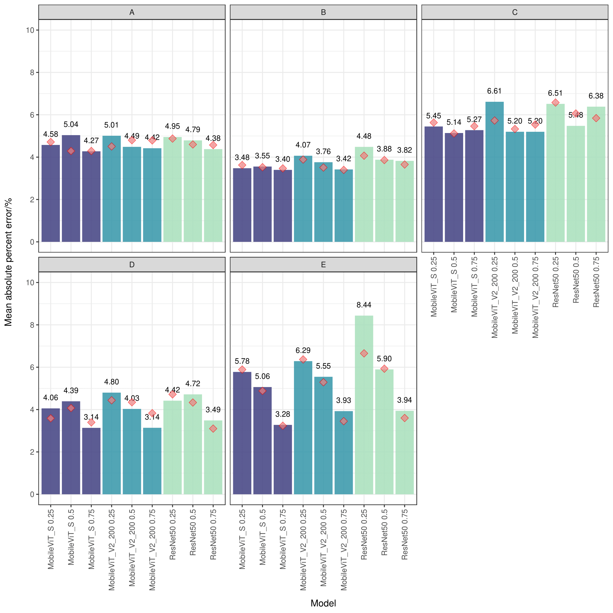

# Industry-scale prediction of video-derived pig body weight using efficient convolutional neural networks and vision transformers
## Preprint
[Link]()
## Abstract
Accurate pig body weight measurement is critical for pig growth, health, and marketing, but conventional manual weighing methods are time-consuming and may cause potential stress to the animals. Although there is a growing trend towards the use of three-dimensional cameras coupled with computer vision approaches for pig body weight prediction, such as supervised neural networks, their validation with large-scale data collected at multiple time points in commercial environments is still limited. Therefore, the main objective of this study was to predict pig body weight from repeatedly measured video data obtained in a commercial environment using efficient convolutional neural networks and efficient vision transformers. An Intel RealSense D435 camera was installed on a commercial farm to collect top-view videos of over 600 pigs every two weeks at six different time points over three months. Manually measured body weight records were also collected using a digital weighing system. We used an automated video conversion pipeline and fine-tuned YOLOv8 to preprocess the raw depth videos. We then acquired a total of 204,477 depth map files. We applied transfer learning by initializing the weights of two families of lightweight deep neural networks, including MobileNet and MobileViT, with pre-trained weights from ImageNet. ResNet50 was used as the baseline model. We then fine-tuned these models on the pig depth images. The last layer of each model was adjusted to add a dropout layer and a linear regression layer with L2 regularization, allowing direct prediction of body weight for each image without the need for additional image feature extraction steps. We used single time point random repeated subsampling cross-validation (CV1) and time series forecasting cross-validation (CV2) considering limited budget scenarios to evaluate the prediction performance. In CV1, the best prediction mean absolute percentage error (MAPE) for each time point was 4.71\%, 3.80\%, 3.08\%, 5.60\%, 3.42\%, and 3.77\%, respectively. In CV2, the best MAPE was 4.27\%, 3.40\%, 5.12\%, 3.10\%, and 3.24\%, respectively. On average, the MobileViT-S model produced the best prediction MAPE of 3.08\% and 3.10\% in CV1 and CV2, respectively. ViT models always showed better prediction performance than CNN models. Our results suggest that efficient deep learning-based supervised learning models are a promising approach for predicting pig body weight from industry-scale depth video data.

## Video preprocessing
- [ConvertBag2DepthImage&CSV.py](./Preprocessing/ConvertBag2DepthImage&CSV.py) The depth data collected in .bag video format were converted to PNG depth images and comma-separated value (CSV) depth map files  

- [YOLOv8QualityControl.py](./Preprocessing/YOLOv8QualityControl.py) YOLOv8 to clean up raw dataset.

  

<i>Figure2. YOLOv8 detection examples. (A) No detection: the pig is not in the center of the image. (B) Pig detection rate of 0.89: acceptable image because the pig is in the center of the image. (C) Pig and block detection: both the pig and the block are in the image. (D) Pig and block detection: both the pig and the block are in the image, but the pig is not in the center of the image. (E) No detection: multiple pigs in the image. (F) Block detection rate of 0.63: Only block is detected. (G) Pig and block detection: the camera is positioned in the opposite direction. (H) Pig detection rate of 0.90: acceptable image because the pig is in the center of the image but the camera is positioned in the opposite direction.</i>    

- [ImageCount_drawing.Rmd](./Preprocessing/ImageCount_drawing.Rmd) Image Count per animal.

  

<i>Figure3. Number of images for each pig across six farm visits. T1 to T6 represent six time points analyzed in this study. The dotted red line represents the number of images of 20.</i>

## Deep learning models

  

<i>Figure 4. Overview of the deep learning workflow for body weight prediction. Depth videos were processed into images and comma-separated values (CSV) files. YOLOv8 filtered out poorly positioned or obstructed images. The quality-controlled CSV files were converted to grayscale images, padded, and resized. Neural networks are then trained and evaluated using four metrics. MAPE: mean absolute percentage error; $R^2$: coefficient of determination; MAE: mean absolute error; and RMSE: root mean squared error.</i>

### Depth file preprocessing
- [ConvertCSV2DepthImage.py](./Preprocessing/ConvertCSV2DepthImage.py) Convert depth CSV files containing distance information in meters to depth grayscale images.
  
### Supervised neural networks
- [train_test.py](./DeepLearningModels/train_test.py) Deep learning models training. 

## Cross-validation strategy
This part was run on the Virginia Tech Advanced Research Computing ([ARC](https://arc.vt.edu/)) with two 80Gb NVIDIA DGX A100 graphics cards.
- Single time point cross validation (CV1)
  - [generate_sbatch_tinker_cv1.sh](./DeepLearningModels/Run/cv1/generate_sbatch_tinker_cv1.sh) 
  - [generate_multiple_sbatch_tinker_cv1.sh](./DeepLearningModels/Run/cv1/generate_multiple_sbatch_tinker_cv1.sh)

- Time series forecasting cross-validation design (CV2)
  - [generate_sbatch_tinker_cv2.sh](./DeepLearningModels/Run/cv2/generate_sbatch_tinker_cv2.sh)
  - [generate_multiple_sbatch_tinker_cv2.sh](./DeepLearningModels/Run/cv2/generate_multiple_sbatch_tinker_cv2.sh)

- Submit all jobs simultaneously. 
  - [submit_all.sh](./DeepLearningModels/Run/submit_all.sh)

  

  <i>Figure 5. Time series forecasting cross-validation design. Subsets of pigs from earlier and most recent time points (shown in blue) were used to train models to predict the body weight of pigs at the most recent time points (shown in red). Five scenarios (A to E) were considered for predicting pigs from T2 to T6. T1 to T6 represent six farm visits.</i>

### Activation heatmaps visualization
- [gradcam.ipynb](./Postprocessing/gradcam.ipynb)

  

<i>Figure 9. Gradient-weighted class activation mapping heatmaps for arbitrarily selected A) light, B) average, and C) heavy pigs from the T5 visit, generated with MobileViT-S.</i>

### Prediction visulization
- Single time point cross-validation (CV1) prediction results
  - [MAPE barplot](./Postprocessing/Mobile_performance_plot_drawing.Rmd) 
  - [Scatter plot](./Postprocessing/prediction_scatter_subgroup_drawing.ipynb)
  - [Subgroup barplot](./Postprocessing/prediction_scatter_subgroup_drawing.ipynb)

  

<i>Figure 6. Single time point prediction results in the testing sets using the best model at each visit, along with the overall performance. The plots compare the predicted weight with the observed weight (ground truth). The red line represents the slope of 1. T1 to T6 represent six farm visits. RMSE: root mean squared error; $R^2$: coefficient of determination; MAPE: mean absolute percentage error;  and MAE: mean absolute error. </i>

- Time series forecasting cross-validation (CV2) prediction results
  - [MAPE barplot](./Postprocessing/Mobile_performance_plot_drawing.Rmd)

  

<i>Figure 10. Time series forecasting cross-validation prediction results. 0.25, 0.5, and 0.75 represent scenarios for the subset ratios 25\%:75\%, 50\%:50\%, and 75\%:25\%. Here, 75\%:25\% indicates that 75\% of the data points from all previous time points were used as the training set to predict 25\% of the current data points. The red squares represent full design cross-validation, and the bars represent sparse design cross-validation results.</i>

### Appendix
- [loss_curve_drawing.py](./Postprocessing/loss_curve_drawing.py) Single time point cross-validation training history using the best model at each visit. 